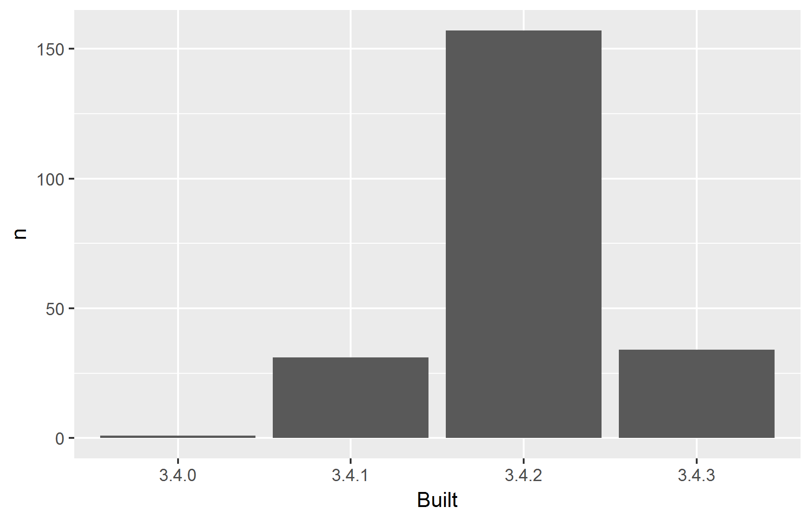

<!-- README.md is generated from README.Rmd. Please edit that file -->
packages-report
===============

Workshop challenge checklist
----------------------------

*As you complete tasks, you can ~~cross them out~~ by surrounding with `~~`.*

~~.\* Have a look around the files here. Where are the R scripts? What are the directories `data` and `figs` for?~~.* ~~.\* Notice that this README is an `.Rmd` file. That means it could contain R code and will need to be rendered to create `README.md`.~~.* ~~.\* Open [R/01\_write-installed-packages.R](R/01_write-installed-packages.R). Write the script as directed. Run it. Commit and push the current state.~~.* ~~.\* Open [R/02\_wrangle-packages.R](R/02_wrangle-packages.R). Fill in the missing pieces of the script as directed. Run it. Commit and push the current state.~~.* ~~.\* Open [R/03\_barchart-packages-built.R](R/03_barchart-packages-built.R). Fill in the missing pieces of the script as directed. Run it. Commit and push the current state.~~.* ~~.* Fill in the blanks below in this README, using the results stored elsewhere. \* If you get this far, write an R script to run the whole analysis and, perhaps, another script that does a `make clean` style reset.

Overview
--------

The goal of packages-report is to FINISH THIS SENTENCE.

I have `FILL THIS IN!!!` add-on packages installed.

Here's how they break down in terms of which version of R they were built under, which is related to how recently they were updated on CRAN.

    #> # A tibble: 4 x 4
    #>       X  Built     n        prop
    #>   <int> <fctr> <int>       <dbl>
    #> 1     1  3.4.0     1 0.004484305
    #> 2     2  3.4.1    31 0.139013453
    #> 3     3  3.4.2   157 0.704035874
    #> 4     4  3.4.3    34 0.152466368

### Flow of the analysis

*If you have time, document the analysis works, using internal links.*

### Flow of the analysis

Run [R/90\_make-clean.R](R/90_make-clean.R) to clean out downstream products.

Run [R/95\_make-all.R](R/95_make-all.R) to re-run the analysis and re-render this README.

<table>
<colgroup>
<col width="27%" />
<col width="27%" />
<col width="44%" />
</colgroup>
<thead>
<tr class="header">
<th>Input</th>
<th>Script</th>
<th>Output</th>
</tr>
</thead>
<tbody>
<tr class="odd">
<td></td>
<td><a href="R/01_write-installed-packages.R" class="uri">R/01_write-installed-packages.R</a></td>
<td><a href="data/installed-packages.csv" class="uri">data/installed-packages.csv</a></td>
</tr>
<tr class="even">
<td><a href="data/installed-packages.csv" class="uri">data/installed-packages.csv</a></td>
<td><a href="R/02_wrangle-packages.R" class="uri">R/02_wrangle-packages.R</a></td>
<td><a href="data/add-on-packages.csv" class="uri">data/add-on-packages.csv</a> <a href="data/add-on-packages-freqtable.csv" class="uri">data/add-on-packages-freqtable.csv</a></td>
</tr>
<tr class="odd">
<td><a href="data/add-on-packages-freqtable.csv" class="uri">data/add-on-packages-freqtable.csv</a></td>
<td><a href="R/03_barchart-packages-built.R" class="uri">R/03_barchart-packages-built.R</a></td>
<td><a href="figs/built-barchart.png" class="uri">figs/built-barchart.png</a></td>
</tr>
</tbody>
</table>
